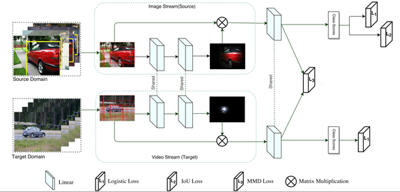

# Adapting Object Detectors 

Implementation of the paper [Adapting Object Detectors from Images toWeakly Labeled Videos](http://www.cs.umanitoba.ca/~ywang/papers/bmvc17_adapt.pdf). 

### Usage
The first step of our approach is to generate a shortlist of object proposals from source and target images. We use the edge boxes algorithm for generating the object proposals. 
Let K be the number of object proposals generated on the image. We represent each proposal as a 4096-dimensional CNN feature vector. 

### Run the experiment
-- Get into each folder named as class name [i.e. 01_aeroplane]
-- Keep the .t7 file of the dataset with data, ground truth bounding box, class label and proposals.
-- Run doall.lua file using th command [i.e. th ../doall.lua]

### Model Architecture

